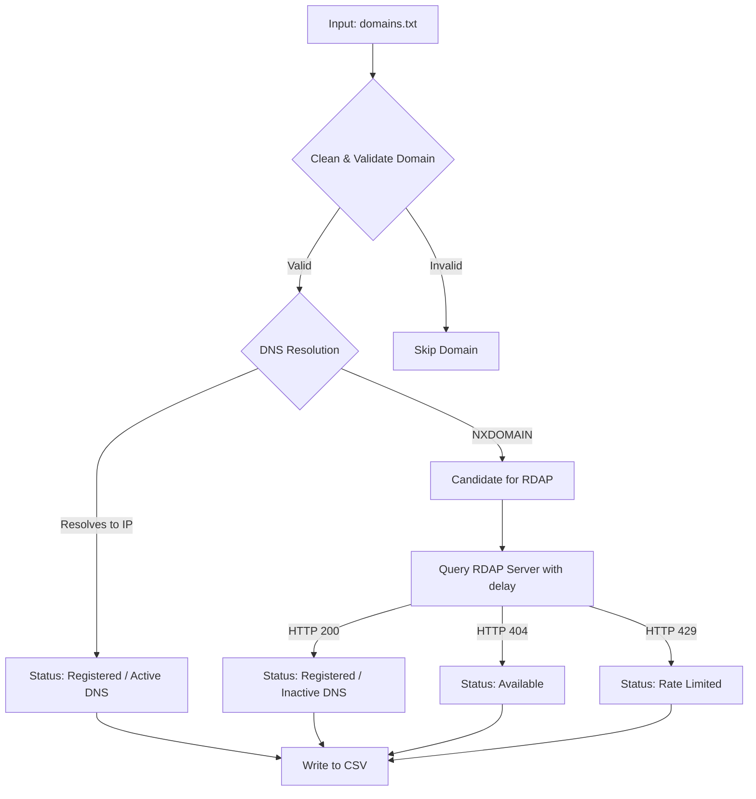

# Domain Availability Checker

A fast, lightweight, and rate-limit-friendly command-line script to check domain availability in bulk. 

Unlike traditional checkers that scrape websites or require developer registration with registrars (like GoDaddy or Namecheap), this tool runs **completely anonymously** and **requires no API keys**.

## Features

- **No Registrar Accounts / API Keys Required:** Runs 100% out of the box using public standards.
- **DNS Pre-filtering:** Instantly filters out active/taken domains using standard DNS resolution. This prevents unnecessary registry queries.
- **RDAP Verification:** Queries the standard public Registration Data Access Protocol (RDAP) API for candidate domains that lack DNS records to verify if they are truly available or just dormant.
- **Rate-limit Protection:** Automatically throttles queries with a configurable delay to prevent registry blocking.
- **CSV Output:** Exports clean, structured reports for easy ingestion into spreadsheet applications.

## How It Works



## Setup & Requirements

The script uses Python's standard library. There are **no external dependencies** to install.

1. Clone this repository.
2. Create an input text file (e.g., `domains.txt`) listing the domains you wish to check, with one domain per line.

## Usage

Run the script by passing the input file path and your desired output CSV file path:

```bash
python check_domains.py domains.txt results.csv
```

### Adjusting Query Delay
To respect domain registry policies and avoid rate-limiting, the script includes a default delay of `1.5` seconds between RDAP queries. You can customize this delay by passing a third argument:

```bash
python check_domains.py domains.txt results.csv 2.5
```

## Output Format

The output CSV file contains the following columns:

| Column | Description |
| :--- | :--- |
| **Domain** | The domain name checked. |
| **Status** | `Available`, `Registered`, `Rate Limited`, or `Error`. |
| **Details** | Additional context (e.g., `Registered (Active DNS)`, `Unregistered (404 Not Found)`). |
