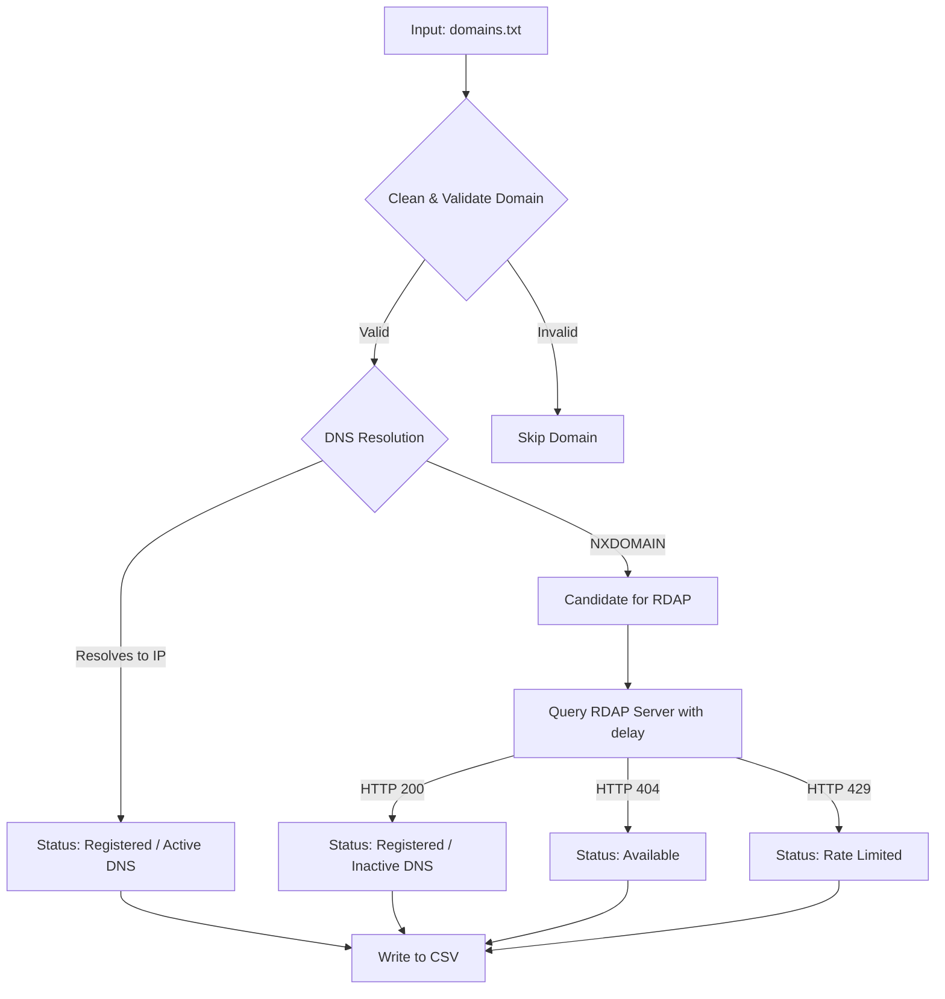

# Domain Availability Checker

A fast, lightweight, and rate-limit-friendly command-line script to check domain availability in bulk. 

Unlike traditional checkers that scrape websites or require developer registration with registrars (like GoDaddy or Namecheap), this tool runs **completely anonymously** and **requires no API keys**.

## Features

- **No Registrar Accounts / API Keys Required:** Runs 100% out of the box using public standards.
- **DNS Pre-filtering:** Instantly filters out active/registered domains using concurrent DNS resolution, saving CPU and network resources.
- **Multithreaded Execution:** Leverages Python's thread pool concurrency (`ThreadPoolExecutor`) for both DNS resolving and RDAP checking. The degree of concurrency is configurable via `--threads`.
- **RDAP Verification:** Queries the Registration Data Access Protocol (RDAP) API for candidate domains (lacking DNS records) to verify availability.
- **Auto-Tuning Dynamic Rate Limiter:** Built-in feedback loop that detects registry rate limits (HTTP 429), dynamically scales the launch delay, and sleeps all threads during the cooldown.
- **Jitter-Proof Launch Spacing:** Guarantees sequential, thread-safe spacing between requests and retries to prevent concurrent spikes from triggering server blocks.
- **Smart Resume Caching:** Reads the output file or an optional cache CSV (`-c` / `--cache`) on startup. Skips completed results, but automatically queues previous failures (`Rate Limited`, `Error`, `Unknown`) directly back to the RDAP check, bypassing redundant DNS resolution. The cache parser supports standard datetimes as well as Excel serial dates.
- **Live Thread-Safe Writing:** Appends results to the CSV file one by one using a thread lock to prevent data loss if the run is interrupted.
- **Real-Time Progress & ETA:** Displays log indices, lookup statuses, and a dynamically calculated human-readable Estimated Time to Completion (ETA).

## How It Works



## Setup & Requirements

The script uses Python's standard library. There are **no external dependencies** to install.

1. Clone this repository.
2. Create an input text file (e.g., `domains.txt`) listing the domains you wish to check, with one domain per line.

## Usage

The script is executed from the command line by passing positional arguments and optional flags:

```bash
python check_domains.py <input_file> <output_file> [delay] [options]
```

### Command Line Options

| Argument / Flag | Type | Description | Default |
| :--- | :--- | :--- | :--- |
| `input_file` | Positional | Path to the text file listing domains to check (one per line). | *(Required)* |
| `output_file` | Positional | Path to the CSV file where results will be saved. | *(Required)* |
| `delay` | Positional (Optional) | Base launch delay spacing (in seconds) between RDAP requests. | `1.2` |
| `-t, --threads` | Flag (Optional) | Number of concurrent worker threads for DNS and RDAP querying. | `20` |
| `-r, --retries` | Flag (Optional) | Maximum retries allowed for rate-limited requests before marking as `Rate Limited`. | `3` |
| `-c, --cache` | Flag (Optional) | Path to an optional cache CSV file to skip already checked domains. | *None* |

---

### Usage Examples

#### 1. Basic Bulk Check (Safe Defaults)
Checks the list using a safe `1.5s` delay and 20 worker threads:
```bash
python check_domains.py domains.txt results.csv
```

#### 2. Optimized Speed Check (Recommended)
Launches the checker with a fine-tuned `1.15s` delay which is the minimum stable delay that stays safe under Cloudflare limits:
```bash
python check_domains.py domains.txt results.csv 1.15
```

#### 3. Low-Concurrency Check
Runs with a safer `2.0s` delay and limits the worker thread pool count to `5`:
```bash
python check_domains.py domains.txt results.csv 2.0 --threads 5
```

#### 4. Resilient Check (High Retries)
Runs at optimal speed but allows rate-limited queries to retry up to `5` times (spacing each retry by 30 seconds of cooldown) before declaring failure:
```bash
python check_domains.py domains.txt results.csv 1.15 --threads 20 --retries 5
```

### Rate Limits & Recommended Delay
The public RDAP bootstrap service is protected by Cloudflare, which enforces a strict rate limit of **10 requests in 10 seconds** (effectively **1 request per second**). 

To maximize speed while staying completely rate-limit-free from the start, **it is highly recommended to start with a delay of `1.15` seconds and use multithreading**:

```bash
python check_domains.py domains.txt results.csv 1.15 --threads 20
```

* **Why 1.15s is the stable minimum**: Although the limit is 10 requests/10s, running 20 concurrent threads creates small CPU/GIL and network latency variations (jitter). Any starting delay lower than `1.15s` will eventually bunch requests together close enough to group 11 requests in 10 seconds, triggering a rate limit block. A starting delay of `1.15s` absorbs this jitter completely.
* **Dynamic Cooldown & Scaling**: If you start with a faster delay, the script's built-in feedback loop will automatically scale up the query delay by `0.1s` per rate-limit incident and pause all threads for 30 seconds before resuming.

## Output Format

The output CSV file contains the following columns:

| Column | Description |
| :--- | :--- |
| **Domain** | The domain name checked. |
| **Status** | `Available`, `Registered`, `Rate Limited`, `Error`, or `Unknown`. |
| **Details** | Additional context (e.g., `Registered (Active DNS)`, `Unregistered (404 Not Found)`). |
| **LastChecked** | Date and time the domain status was verified. |

## Running Tests

This project includes a test suite under `test_check_domains.py` using Python's standard `unittest` library. It covers domain validation, cache loading and skip behavior, resumption logic, and mock DNS/RDAP resolution.

To run all tests:

```bash
python -m unittest test_check_domains.py
```

